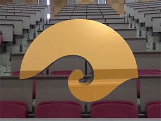
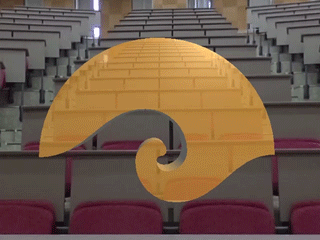

# ゲームグラフィックス特論

## 課題B

このプログラムは下図のような表示を行います。

> 

1. このフラグメントシェーダのソースプログラム simple.frag に映り込み処理 (B第3回) を実装してください。

> 

2. このフラグメントシェーダのソースプログラム simple.frag に屈折処理(B第5回) を実装してください。

> 

それぞれの simple.frag を Moodle にアップロードしてください。
詳しくは[解説](image/ggsampleB.pdf)を参照してください。
