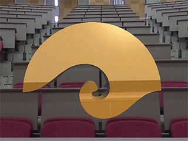
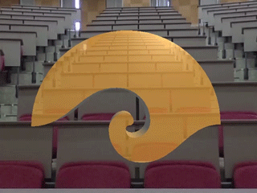

# ggsampleB - 自由課題 B (環境マッピング / 屈折マッピング)

## 1. 概要

本プログラムは、[ゲームグラフィックス特論](https://tokoik.github.io/gg/)の自由課題 B 用のひな型プログラムです。

- 講義ポータル: [ゲームグラフィックス特論 - 床井研究室](https://tokoik.github.io/gg/)

## 2. 課題の内容

本プロジェクト (ggsampleB) は、背景画像と 3D モデルを読み込んで、3D モデルに陰影をつけて背景画像に合成して表示するプログラムです。3D モデルはマウスの左ボタンのドラッグで回転できます。また背景画像もマウスの右ボタンのドラッグで回転できます。

フラグメントシェーダのソースプログラム `simple.frag` を修正して、以下の効果を実装してください。

### 1. 環境マッピング（反射・映り込み）

環境マッピングを実装して、背景の画像が 3D モデルの表面に映り込むようにしてください。

> 

### 2. 屈折マッピング

屈折マッピングを実装して、背景の画像が 3D モデルを通して屈折して見えるようにしてください。

> 

- 屈折率（の比）は 1.5 程度にしてください。なお、3D モデルは隠面消去処理（デプスバッファ・背面カリング）を行っているため、視点に対して反対側を向いている面（裏面）に屈折マッピングを行う必要はありません。

### 提出について

それぞれの効果を実装した `simple.frag` を提出してください。
詳細な解説は [解説 PDF](image/ggsampleB.pdf) を参照してください。

## 3. 対応環境

- **Windows**: Visual Studio 2019 / 2022 / 2026 (CMake 経由で GLFW 3.4 を自動ダウンロード)
- **macOS**: Xcode (GLFW 3.4 を自動ダウンロード、OpenGL Framework を使用)
- **Ubuntu Linux**: GCC / Make (システム標準の libglfw3-dev, libgl1-mesa-dev を使用)

## 4. ビルド手順

### Windows (Visual Studio)

```pwsh
cmake -B build -S .
cmake --build build --config Release
```

### macOS (Xcode)

```bash
cmake -B build -G Xcode
cmake --build build --config Release
```

### Ubuntu Linux (Makefile)

```bash
sudo apt-get update
sudo apt-get install -y libglfw3-dev libgl1-mesa-dev
cmake -B build -S .
cmake --build build
```

## 5. 起動方法

ビルド完了後、生成された実行ファイルを実行します。

- **Windows**: `build/Release/ggsampleB.exe`
- **macOS**: `build/Release/ggsampleB.app`
- **Linux**: `build/ggsampleB`

## 6. 操作方法

- **マウス左ドラッグ**: 3D モデルの回転
- **マウス右ドラッグ**: 背景画像の回転
- **マウスホイール**: ズームイン / ズームアウト
- **[q] / [Q] / [ESC]**: プログラムの終了
